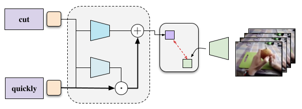

<div align="center">

# Video-adverb retrieval with compositional adverb-action embeddings

<!-- [](https://arxiv.org/abs/2305.149309) -->
[-BMVC_2023-4b44ce.svg)](https://arxiv.org/abs/2309.15086)
<br>
[](https://paperswithcode.com/sota/video-adverb-retrieval-on-howto100m-adverbs?p=video-adverb-retrieval-with-compositional)
[](https://paperswithcode.com/sota/video-adverb-retrieval-on-air?p=video-adverb-retrieval-with-compositional)
[](https://paperswithcode.com/sota/video-adverb-retrieval-on-activitynet-adverbs?p=video-adverb-retrieval-with-compositional)
[](https://paperswithcode.com/sota/video-adverb-retrieval-on-msr-vtt-adverbs?p=video-adverb-retrieval-with-compositional)
[](https://paperswithcode.com/sota/video-adverb-retrieval-on-vatex-adverbs?p=video-adverb-retrieval-with-compositional)
<br>
[](https://github.com/pre-commit/pre-commit)
[](https://pytorch.org/get-started/locally/)
[](https://black.readthedocs.io/en/stable/)
[](https://github.com/ExplainableML/ReGaDa/blob/main/LICENSE)
</div>

<div align="center">

## [Paper](https://arxiv.org/abs/2309.15086) / [Project Page](https://hummelth.github.io/ReGaDa/)
</div>

This repository contains the official code for the BMVC 2023 (Oral) paper [Video-adverb retrieval with compositional adverb-action embeddings](https://arxiv.org/abs/2309.15086).



## Requirements

Install all required dependencies into a new virtual environment via conda.

```shell
conda env create -f environment.yaml
```

## Datasets

We provide pre-extracted S3D features of all datasets to download. We thank the authors of [Action Changes](https://github.com/dmoltisanti/air-cvpr23) for sharing them with us.

You can dowload the features of all datasets here:

- [Download S3D features](#)

The features should be (per default) placed inside a ```features``` folder:

```shell
mkdir features
unzip video-adverb-datasets_s3d.zip -d features/
```

In case you store the features in a different location, you can set the path during execution:

```python
python train.py feature_dir=PATH_TO_FEATURES [...]
```

To download videos and to extract S3D features of the datasets on your own, you can follow the instructions given here: [https://github.com/dmoltisanti/air-cvpr23](https://github.com/dmoltisanti/air-cvpr23#download-videos)

### Unseen adverb-action composition splits

[Pseudo Adverbs](https://github.com/hazeld/PseudoAdverbs) proposed a VATEX Adverbs dataset split for evaluating unseen adverb-action compositions. We replicate this split for the S3D features used in this work by omitting unavailable videos and additionally propose new splits for evaluating the performance on unseen compositions for the ActivityNet Adverbs and MSR-VTT Adverbs datasets. The statistics for the dataset splits are given below:

|| VATEX Adv. | ActivityNet Adv. | MSR-VTT Adv. |
|:-------------------|:-----:|:-----:|:-----:|
| `# train samples`      | 6603 | 1490 | 987 |
| `# unlabelled samples` | 3317 | 634  | 306 |
| `# test samples`       | 3293 | 848  | 454 |
| `# pairs train`        | 319  | 635  | 225 |
| `# pairs unlabelled`   | 168  | 537  | 114 |
| `# pairs test`         | 316  | 543  | 225 |

You can find the corresponding files for the unseen compositions splits at ```splits/unseen_compositions/DATASET_NAME```. Each folder contains the following files:

- `antonyms.csv`: mapping file for mapping adverbs to their respective antonym
- `train.csv`: list of samples / videos used for training
- `test.csv`: list of samples / videos used for testing
- `unlabelled.csv`: list of samples / videos that can be used as unlabelled data (pseudo-labelling)

## Model weights

We additionally provide model checkpoints. The checkpoints can be downloaded [here]().

## Training

In the following, we provide commands for training our method ReGaDa for video-adverb retrieval. We provide commands for both the main experiments and for the experiment on unseen adverb-action compositions.

### Main results

```python
python train.py +run=main_howto100m    # HowTo100M Adverbs
python train.py +run=main_air          # Adverbs in Recipes
python train.py +run=main_activitynet  # ActivityNet Adverbs
python train.py +run=main_msrvtt       # MSR-VTT Adverbs
python train.py +run=main_vatex        # VATEX Adverbs
```

### Unseen compositions

```python
python train.py +run=unseen_vatex        # VATEX Adverbs
python train.py +run=unseen_activitynet  # ActivityNet Adverbs
python train.py +run=unseen_msrvtt       # MSR-VTT Adverbs
```

## Evaluation

You can evaluate your trained model, or one of the model checkpoints provided, using the following command:

```python
python test.py checkpoint=CHECKPOINT_PATH
```

where CHECKPOINT_PATH is the checkpoint directory of the model to evaluate.

## Results

### Main Results

#### HowTo100M Adverbs

| Model              | mAP W | mAP M | Acc-A |
|:-------------------|:-----:|:-----:|:-----:|
| Priors             | 0.446 | 0.354 | 0.786 |
| S3D pre-trained    | 0.339 | 0.238 | 0.560 |
| TIRG               | 0.441 | 0.476 | 0.721 |
| Action Modifier    | 0.406 | 0.372 | 0.796 |
| AC<sub>CLS</sub>   | 0.562 | 0.420 | 0.786 |
| AC<sub>REG</sub>   | 0.555 | 0.423 | 0.799 |
| ReGaDa (ours)      | **0.567** | **0.528** | **0.817** |

#### Adverbs in Recipes

| Model              | mAP W | mAP M | Acc-A |
|:-------------------|:-----:|:-----:|:-----:|
| Priors             | 0.491 | 0.263 | 0.854 |
| S3D pre-trained    | 0.389 | 0.173 | 0.735 |
| TIRG               | 0.485 | 0.228 | 0.835 |
| Action Modifier    | 0.509 | 0.251 | 0.857 |
| AC<sub>CLS</sub>   | 0.606 | 0.289 | 0.841 |
| AC<sub>REG</sub>   | 0.613 | 0.244 | 0.847 |
| ReGaDa (ours)      | **0.704** | **0.418** | **0.874** |

#### ActivityNet Adverbs

| Model              | mAP W | mAP M | Acc-A |
|:-------------------|:-----:|:-----:|:-----:|
| Priors             | 0.217 | 0.159 | 0.745 |
| S3D pre-trained    | 0.118 | 0.070 | 0.560 |
| TIRG               | 0.186 | 0.111 | 0.709 |
| Action Modifier    | 0.184 | 0.125 | 0.753 |
| AC<sub>CLS</sub>   | 0.130 | 0.096 | 0.741 |
| AC<sub>REG</sub>   | 0.119 | 0.079 | 0.714 |
| ReGaDa (ours)      | **0.239** | **0.175** | **0.771** |

#### MSR-VTT Adverbs

| Model              | mAP W | mAP M | Acc-A |
|:-------------------|:-----:|:-----:|:-----:|
| Priors             | 0.308 | 0.152 | 0.723 |
| S3D pre-trained    | 0.194 | 0.075 | 0.603 |
| TIRG               | 0.297 | 0.113 | 0.700 |
| Action Modifier    | 0.233 | 0.127 | 0.731 |
| AC<sub>CLS</sub>   | 0.305 | 0.131 | 0.751 |
| AC<sub>REG</sub>   | 0.282 | 0.114 | 0.774 |
| ReGaDa (ours)      | **0.378** | **0.228** | **0.786** |

#### VATEX Adverbs

| Model              | mAP W | mAP M | Acc-A |
|:-------------------|:-----:|:-----:|:-----:|
| Priors             | 0.216 | 0.086 | 0.752 |
| S3D pre-trained    | 0.122 | 0.038 | 0.586 |
| TIRG               | 0.195 | 0.065 | 0.735 |
| Action Modifier    | 0.139 | 0.059 | 0.751 |
| AC<sub>CLS</sub>   | 0.283 | 0.108 | 0.754 |
| AC<sub>REG</sub>   | 0.261 | 0.086 | 0.755 |
| ReGaDa (ours)      | **0.290** | **0.113** | **0.817** |

### Retrival of Adverbs for unseen adverb-action compositions (binary antonym accuracy)

| Model | VATEX Adv. | ActivityNet Adv. | MSR-VTT Adv. |
|:-------------------|:--------:|:--------:|:--------:|
| CLIP               | 54.5     | 55.1     | 57.0     |
| Action Modifier    | 53.8     | 57.0     | 56.0     |
| AC<sub>CLS</sub>   | 54.3     | 55.1     | 53.7     |
| AC<sub>REG</sub>   | 54.9     | 53.9     | 59.0     |
| ReGaDa (ours)      | **61.7** | **58.4** | **61.0** |

## Citation

If you find this code useful, please consider citing:

```
@inproceedings{hummel2023regada,
  author    = {Hummel, Thomas and Mercea, Otniel-Bogdan and Koepke, A. Sophia and Akata, Zeynep},
  title     = {Video-adverb retrieval with compositional adverb-action embeddings},
  booktitle = {BMVC},
  year      = {2023}
}
```

#### Other repositories

Small portions of the code are adapted from the following repositories:

- [S3D](https://github.com/antoine77340/S3D_HowTo100M)
- [Action Modifiers](https://github.com/hazeld/action-modifiers)
- [Pseudo Adverbs](https://github.com/hazeld/PseudoAdverbs)
- [Action Changes (AiR)](https://github.com/dmoltisanti/air-cvpr23)
